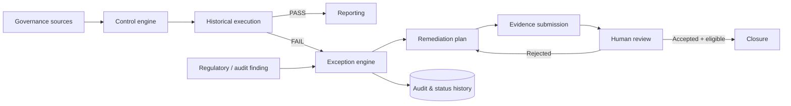

# Regulatory Data Controls & Exception Management Platform

A production-style portfolio implementation of an enterprise data-governance control and exception workflow. It uses synthetic data only and is not an official Deutsche Bank or regulatory system.

## Overview

The platform answers which controls fail, which assets and divisions are affected, who owns remediation, what evidence supports closure, and who approved each decision. Unlike a ticketing dashboard, the domain starts with executable governance controls and preserves the chain from a historical execution through exception, remediation, evidence, independent review, and closure.



**Core workflow:** Control → Execution → Failure → Exception → Remediation → Evidence → Review → Closure

## Key features

- Database-backed controls for ownership, stewardship, CDE definition, lineage, data quality, classification, metadata, documentation, regulatory mapping, and annual review.
- Immutable execution history and active-issue duplicate suppression.
- Enforced lifecycle prerequisites, transactional status history, closure rationale, reviewer attribution, and append-only audit events.
- Evidence upload validation (allow-list, 10 MB limit), SHA-256 checksums, opaque storage keys, and no public file serving.
- Regulatory and audit finding inventory linked to exceptions.
- Computed management metrics, aging, division views, overdue detection, control performance, CSV export, backend filtering, and global search API.
- JWT authentication and roles: Admin, Governance Analyst, Data Owner, Data Steward, Reviewer, Compliance Officer, and Auditor.
- Assistive AI abstraction with explicitly labeled deterministic demo fallback and AI audit records. AI never closes cases, approves evidence, changes severity, or assigns accountability.
- Three rerunnable Airflow DAGs and local notification logging abstraction.

## Domain model

`BusinessDivision` owns reporting scope. `DataAsset` and `DataField` describe governed data. `GovernanceControl` produces immutable `ControlExecution` records. Failed executions and `RegulatoryFinding` records create `GovernanceException` cases. `RemediationPlan`, `Evidence`, `ExceptionComment`, and `ExceptionStatusHistory` make the case defensible. `AuditLog` and `AIAuditRecord` preserve system and assistive-AI activity. See [data model](docs/data-model.md).

## Exception and evidence lifecycle

Allowed transitions are enforced in backend services:

`Open → Assigned → Remediation In Progress → Pending Review → Closed`

Assignment requires an owner. Starting remediation requires a plan. Pending review requires completed/submitted remediation and evidence. Closure requires Pending Review status, completed remediation, evidence, accepted evidence, an assigned reviewer, an authorized closing role, and a substantive rationale. Rejection requires a reviewer reason.

## Technology

| Layer | Implementation |
|---|---|
| API | Python 3.12, FastAPI, Pydantic |
| Persistence | SQLAlchemy 2, PostgreSQL 16, Alembic |
| Security | JWT, Argon2 password hashing, role guards |
| Web | React 18, TypeScript strict, Vite, TanStack Query, Recharts |
| Orchestration | Apache Airflow 2.10 |
| Delivery | Docker Compose, GitHub Actions |
| Quality | pytest, httpx, Ruff, ESLint, TypeScript |

## Repository structure

`backend/` contains models, routes, service-layer rules, migration, seed data, and tests. `frontend/` contains the enterprise UI. `airflow/dags/` contains orchestration. `docs/` records project-specific design decisions. `.github/workflows/ci.yml` is the deterministic CI pipeline.

## Setup

```bash
git clone https://github.com/SriChaitanya1824/Regulatory-Data-Controls-Exception-Management-Platform.git
cd Regulatory-Data-Controls-Exception-Management-Platform
cp .env.example .env
docker compose up --build
```

- Application: http://localhost:5173
- OpenAPI / Swagger: http://localhost:8000/docs
- Health: http://localhost:8000/health
- Airflow: http://localhost:8080

For a lightweight backend-only run, use `cd backend && pip install -e '.[dev]' && uvicorn app.main:app --reload`; SQLite is the safe local default when no environment file is loaded.

## Demo credentials

All synthetic users use `Governance2026!`. Start with `analyst@example.com`; other personas are `admin@example.com`, `risk.owner@example.com`, `steward@example.com`, `reviewer@example.com`, `compliance@example.com`, and `auditor@example.com`.

## Seed and exact demo walkthrough

The idempotent seed creates 6 divisions, 8 role-bearing users, 20 assets, 10 controls, 12 findings, and 22 exceptions in varied states. `DG-EXC-2026-001` is the complete lineage story:

1. Open **Exceptions** and select `DG-EXC-2026-001`.
2. Inspect source control `DG-LIN-001`, its failed execution, Customer Risk Dataset, remediation, accepted Lineage validation report, reviewer notes, comments, and full status history.
3. In **Controls**, run `DG-LIN-001`; the actual asset metadata (`lineage_count = 0`) causes a failure. Duplicate suppression retains the existing active issue instead of generating repeated exceptions.
4. Use Swagger to reproduce a new lifecycle via assign, remediation, evidence, evidence review, status, and close endpoints. Invalid closure returns the missing prerequisites.

## API groups

The documented REST API covers `/api/auth`, users, divisions, assets, controls and executions, findings, exceptions and workflow actions, evidence review, dashboard, reports, audit, search, and AI assistance. Pagination and filters execute in the backend. Swagger provides live request schemas.

## Testing

```bash
cd backend
pip install -e '.[dev]'
ruff check app tests
pytest -q

cd ../frontend
npm install
npm run lint
npm test
npm run build
```

CI runs these checks on every push and pull request.

## Security and responsible AI

Secrets come from environment variables; `.env` and uploaded evidence are ignored. Passwords use Argon2 and API operations enforce server-side roles. Evidence has validated MIME type/size, opaque keys, and checksums. This portfolio app does not replace enterprise malware scanning or key management.

AI output is always marked **AI-generated recommendation — Requires human review** and written to an AI audit record. With no configured provider, output states that it is a deterministic development/demo fallback; it never impersonates an LLM. Human reviewers retain every compliance decision.

## Limitations and future enhancements

Implemented locally: governance workflow, control engine, auditability, evidence metadata/storage, dashboards, CSV reporting, orchestration definitions, and demo AI. Simulated: notifications (structured logs), synthetic findings, and local object-style evidence. No real bank data, regulatory feeds, Collibra, ServiceNow, email, Teams, Slack, or cloud storage integration is claimed.

Future work includes enterprise SSO, managed S3/Azure/GCS storage with malware scanning, Collibra/ServiceNow adapters, policy-as-code, real regulatory feeds, event-driven execution, advanced risk scoring, and managed model-provider controls.

Detailed design: [architecture](docs/architecture.md) · [controls](docs/controls.md) · [workflow](docs/exception-workflow.md) · [responsible AI](docs/responsible-ai.md) · [testing](docs/testing.md)
